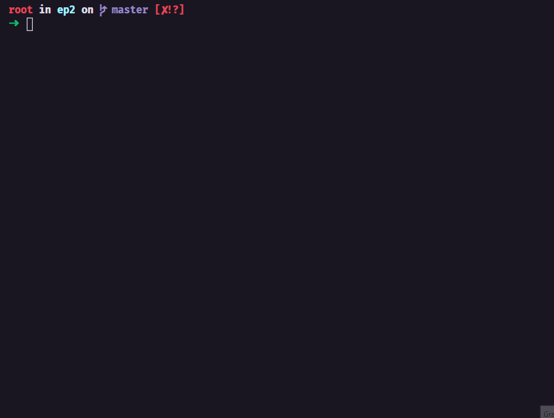

# EP2 - Dessoft

##### Projeto desenvolvido no primeiro semestre do ano de 2021 no curso de Engenharia do Insper
---
## Autores
- Gabriela Albuquerque - Turma 1A
- André Brito - Turma 1A
---
## Descrição do programa
O jogo *solitaire accordion* foi implementado usando Python. Nenhuma interface gráfica foi construída, portanto o jogo deve ser jogado pelo próprio terminal.

**AVISO:** Na exibição de caracteres no terminal foram usadas diferentes cores, que podem variar de acordo com a configuração de seu terminal, portanto caso não visualize alguma parte tente alterar a cor das letras e/ou fundo do terminal.

---
## Preview
Abaixo temos um exemplo do jogo.


---
## Como rodar
- Faça um clone desse repositório e acesse a pasta. 
- Dentro da pasta basta executar o arquivo app.py usando Python 3
  ```python3 app.py```
